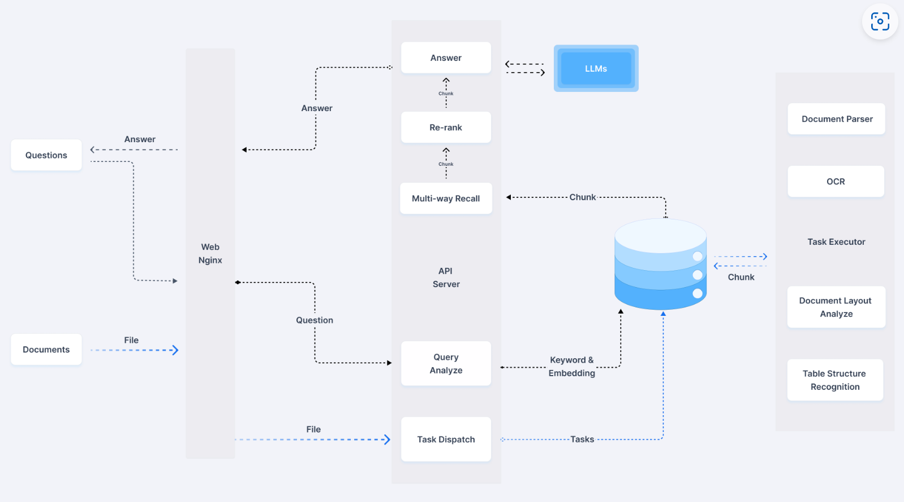

# Introduction
This project is Chatbot base on RAG (Retrieval-Augmented Generation) architecture, including web interface, large language model, RAG framework, RAG bridge, and vector database.
The system allows users to input queries, retrieve relevant information, generate context-aware responses, and display results through a user-friendly web interface. The RAG architecture combines the strengths of retrieval and generation models to enhance the quality and relevance of responses, making it ideal for chatbot applications that require access to a large knowledge base. By leveraging open-source components and frameworks, developers can build powerful conversational agents with advanced capabilities and seamless integration.

---
## Requirements
- Web ui          : [open-webui](https://github.com/open-webui/open-webui) 
- LLM             : [deepseek-r1](https://www.deepseek.com/)
    - [deepseek-r1](https://www.deepseek.com/)
    - [deepseek-r1:32b](https://ollama.com/library/deepseek-r1:32b/blobs/6150cb382311) : run by ollama(need 20GB VRAM)
- RAG Framework   : [langchain](https://github.com/langchain-ai/langchain) 
- RAG Bridge      : [open-webui/pipelines](https://github.com/open-webui/pipelines)
- Vector Database : `TBD` [awesome-vector-database](https://github.com/mileszim/awesome-vector-database) 
- deepseek-pipeline: [deepseek-pipeline](https://github.com/aporb/webui-extentions) 
---

## Architecture
> Project Workflow Overview
> 1. **User Query Input**      : Users enter queries through Open-WebUI.
> 2. **Information Retrieval** : langchain retrieves relevant documents or information from the vector database.
> 3. **Response Generation**   : Retrieved information is combined with the user query and passed to the deepseek model, generating a context-aware response.
> 4. **Result Display**        : Open-WebUI presents the deepseek-generated response to the user.

### 1. Web Interface: Open-WebUI  
Open-WebUI is an open-source graphical user interface designed to provide a user-friendly interaction platform for large language models (LLMs).  
It supports multiple models and backends, offering an intuitive interface that allows users to interact with, configure, and manage models.  
Open-WebUI will serve as the frontend, enabling users to input queries and view model-generated responses.  

### 2. Large Language Model: deepseek  
deepseek is an open-source Chinese large language model known for its high performance and open accessibility.  
It offers various versions, including distilled models optimized for resource-constrained environments.  
deepseek will function as the core generation model, responsible for producing natural language responses based on user queries.  

### 3. RAG Framework: langchain  
langchain is an open-source framework focused on building applications powered by large language models.  
It provides tools to integrate retrieval and generation, allowing developers to construct complex RAG workflows.  
langchain will manage the retrieval of information from the vector database and pass it to the deepseek model for enhanced response generation.  

### 4. RAG Bridge: Open-WebUI Pipelines  
Open-WebUI Pipelines is an extension module of Open-WebUI that allows users to create and manage processing workflows.  
With Pipelines, you can chain together different components (such as retrievers and models) to form a complete processing pipeline.  
Pipelines will act as a bridge, connecting Open-WebUI, langchain, and deepseek to ensure seamless data flow and processing between components.  

### 5. Vector Database: TBD  
The vector database plays a crucial role in the RAG system, storing vector representations of text or documents for rapid retrieval of relevant information.  
You can refer to the awesome-vector-database repository to choose a vector database that best fits your needs.  
Popular options include FAISS and Chroma.  
the vector database will store knowledge base embeddings, enabling langchain to retrieve relevant information and enhance deepseek’s generation capabilities.  

---
## RAG Architecture
1. Get user query
2. Rewrite user query
3. Check whether the user's question is a related question
4. 

## Milestones
### MileStone 1
- [x] Setup open-webui server and open-webui/pipelines server
- [x] Use langchain framework call gemini llm on open-webui via pipelines
- [-] Deploy deepseek-r1:32b at local laptop(Macbook 32GB)
- [ ] Call local deepseek llm on open-webui via pipelines
- [ ] Use LoRa potocol implement Vector Database
- [ ] Implementation RAG architecture
- [ ] Test RAG architecture

## Run
1. `docker-compose up -d`
2. open `http://localhost:3000/`
3. ollama pull deepseek-r1:32b
3. Login to Open WebUI:
    In Open WebUI: Navigate to the Admin Panel > Settings > Connections > OpenAI API section.
    Set the API URL to http://host.docker.internal:9099 and the API key to 0p3n-w3bu!. Your pipelines should now be active. IF localhost doesn't work use host.docker.internal
4. 
